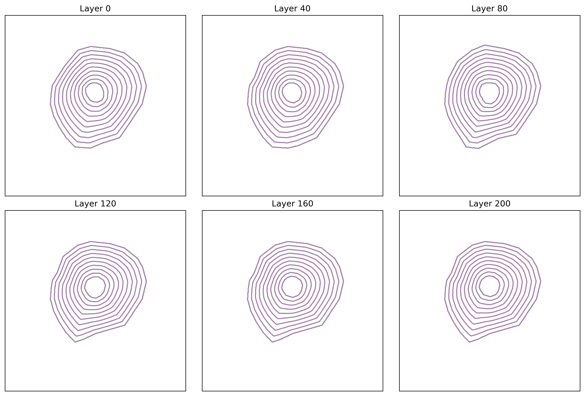
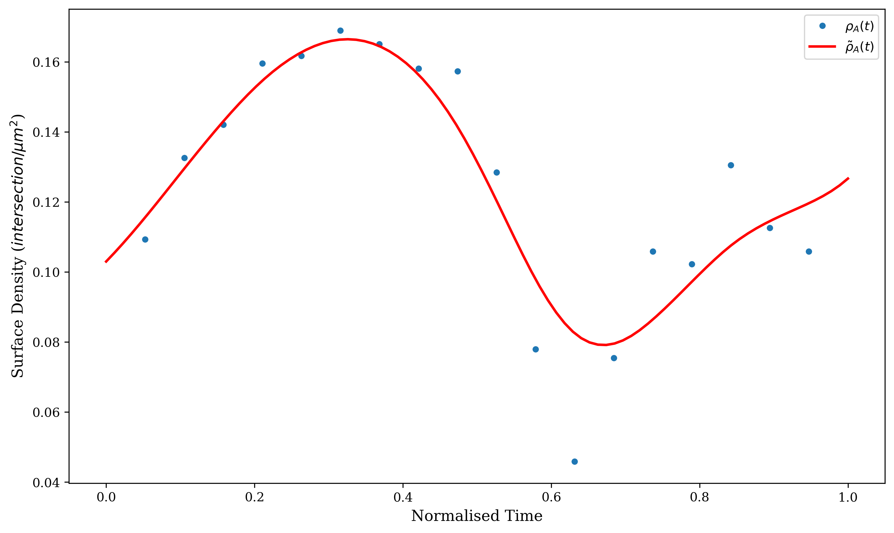

# OsteonX

A Python library for osteocyte network analysis using confocal laser
scanning microscopy data segmented with the Tool for Image and Network
Analysis (TINA), providing lamellar surface reconstruction and temporal
quantification of cellular and dendritic densities via interpolated 3D
Euclidean distance transforms (MLAEDT-3D).

This library extends the Tool for Image and Network Analysis (TINA)
software by providing an interface for importing image and cell/segment
data, as well as a novel set of tools to approximate the geometry of
lamellar surfaces using a [Multi-Label Anisotropic 3D Euclidean Distance
Transform (MLAEDT-3D)](https://github.com/seung-lab/euclidean-distance-transform-3d/).

It computes cellular densities and dendritic surface densities
as a function of the normalised distance from the cement line to the
Haversian canal, enabling quantitative analysis of osteocyte network
organisation within bone osteons.

## Acknowledgements

This project was developed as part of an Undergraduate Engineering
Honours thesis at the Queensland University of Technology (QUT), titled
"Image Analysis of Osteocyte Networks in Bone", in 2025.

**Supervisors:**

- [Associate Professor Pascal Buenzli](https://orcid.org/0000-0003-3962-5393)
- [Dr Jessica Crawshaw](https://orcid.org/0000-0003-0797-1144)

**Student:**

- [Tarang Janawalkar](https://orcid.org/0000-0002-1535-4931)

## Installation

It is recommended that this package is installed within a virtual
environment using `venv` or `conda`. Mayavi is required for 3D
visualisation, but due to VTK API compatibility issues, it is highly
recommended to install Mayavi using `conda-forge` which provides
pre-built binaries with compatible dependencies.

```bash
# Using conda
conda create -n osteonx "python<3.13"
conda activate osteonx
conda install -c conda-forge mayavi
conda remove qt-main pyqt # Conda might install multiple Qt versions
pip install git+https://github.com/tarang74/osteonx.git

# Using venv
# Mayavi 4.8.1-4.8.2 has been tested on Python 3.11
# Mayavi 4.8.3 has been tested on Python 3.12
python -m venv osteonx-env
source osteonx-env/bin/activate
pip install "mayavi==<version>"
pip install git+https://github.com/tarang74/osteonx.git
```

### Basic Usage

```python
from pathlib import Path
from osteonx import io, analysis, visuals

# 1. Import 3D image stack
osteon = io.import_masks(
    path=Path("masks"),
    downsample=(2, 2, 1),
    um_per_voxel=(0.379, 0.379, 0.296),
)

# 2. Compute Euclidean distance transforms
dts = analysis.compute_edt(osteon, path=Path("arrays"))

# 3. Interpolate surfaces
t, phi = analysis.interpolate_surfaces(osteon, dts, tsamples=20)

# 4. Visualise
visuals.plot_surfaces_2d(phi, layers=(phi.shape[2]//2,), out="figures/lamellar_growth_2d.png")
```


## Examples

Three example scripts are provided in the [examples/](examples/) directory:

1. **`lamellar_growth_approximation.py`** - Basic surface interpolation

   ```bash
   python examples/lamellar_growth_approximation.py --help
   ```

   

2. **`cell_density_analysis.py`** - Osteocyte density analysis

   ```bash
   python examples/cell_density_analysis.py --help
   ```

   

3. **`segment_surface_density_analysis.py`** - Dendritic surface density analysis

   ```bash
   python examples/segment_surface_density_analysis.py --help
   ```

   

4. **`derivative_methods_comparison.py`** - Comparison of derivative methods for density estimation

   ```bash
   python examples/derivative_methods_comparison.py --help
   ```

   

## Testing

This package uses `pytest` to test the analysis methods on synthetic
data. Synthetic data is generated inside the `generators` module, which
includes functions to create spherical, cylindrical, and prismatic
geometries. It also generates synthetic cell and segment data arranged
within a lattice or uniformly distributed within the specified volume.

These tests can be run using:

```bash
python -m pytest tests/
```

Test output figures have been compiled in [tests/README.md](tests/README.md).
