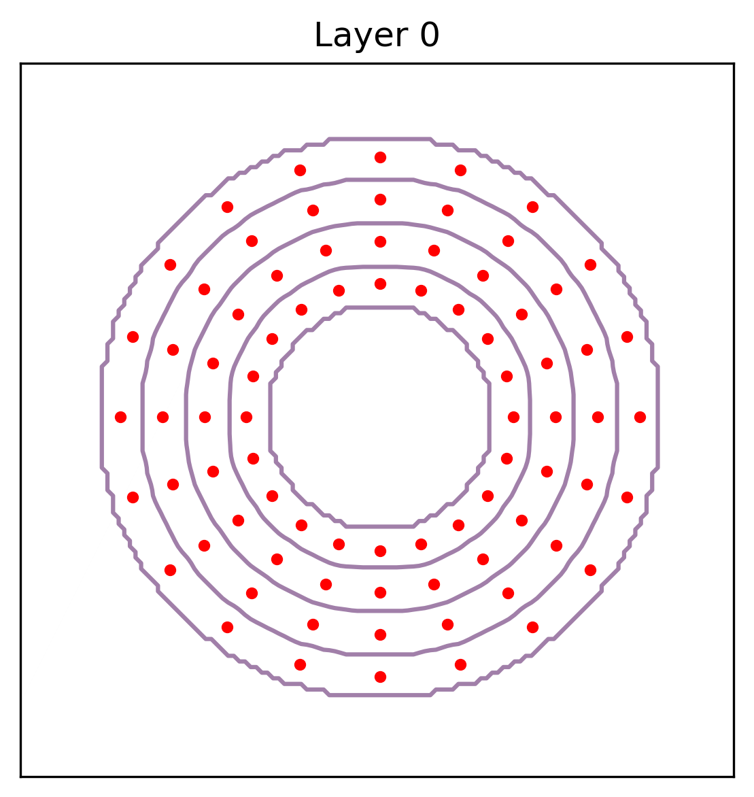

# Test Output Figures

This directory contains test output figures generated by the test scripts
in the `tests/` folder. These figures illustrate the results of various
analysis methods applied to synthetic data, demonstrating the functionality
of the `osteonx` package.

## Cell Density Analysis

See [test_cell_density.py](test_cell_density.py).

### Spheres with Cells

Geometry:

Results:

### Cylinders with Cells

Geometry:

Results:

### Prisms with Cells

Geometry:

Results:

## Segment Surface Density Analysis

See [test_segment_density.py](test_segment_density.py).

### Spheres with Polylines

Geometry:

Results:

### Cylinders with Polylines

Geometry:

Results:

### Prisms with Polylines

Geometry:

Results:

